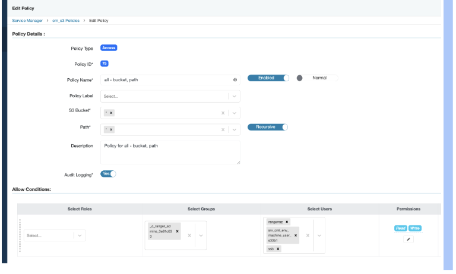
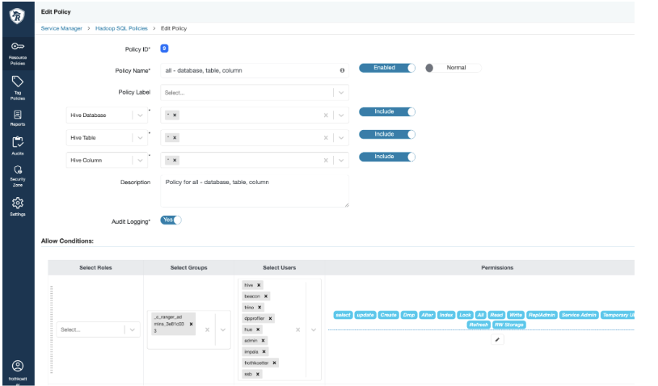

# Triton Baltic Sea Real-Time Geospatial Analytics

This project demonstrates real-time geospatial analytics using **Cloudera Streaming Analytics (CSA)**, **Apache Flink**, **Streaming SQL Builder (SSB)**, and **Apache Iceberg** to monitor vessel movements in the Baltic Sea.

---

## 1. Environment Setup

The analytics engine is powered by a CSA Hub Cluster.

*
**Cluster Name:** `triton-csa`


*
**Runtime Version:** 7.3.1-1.cdh7.3.1.p700.74774806


*
**Key Services:** Flink, Streaming SQL Console, Kafka, and Ranger.


### Ranger Security Policies

Ensure the `ssb` user has the necessary permissions to access data layers:

*
**Hadoop SQL Policy:** Grant "All" permissions for Hive databases, tables, and columns.



*
**S3 Policy:** Grant Read/Write access to the relevant S3 buckets and paths.



---

## 2. Data Ingestion & Source Configuration

Data is ingested into Kafka and then mapped to SSB Virtual Tables.

### Kafka Table Setup

1. Navigate to **Virtual Tables** and select **New Kafka Table**.


2. Define the table (e.g., `ais_events_record`) and select the corresponding Kafka topic.


3.
**Schema Validation:** Use the "Detect Schema" feature to ensure the JSON/Avro payload is valid.


### Catalog Configuration

To interact with Iceberg tables, a Hive Catalog must be added:

* Add a **New Catalog** of type `Hive`.


* Validate the connection; it should successfully discover existing tables in the database.


---

## 3. Iceberg Sink Configuration

To persist streaming data into Apache Iceberg, you must define your sink tables and configure checkpointing.

### Checkpoint Settings

To ensure data is committed to Iceberg, set the Flink job checkpointing interval:

*
**Interval:** `300000ms` (5 minutes).


*
**Mode:** At Least Once.


### Table Definitions (DDL)

Create the reference table for ports and the sink table for monitoring results:

```sql
-- Reference Table: Ports
CREATE TABLE `ssb`.`ssb_default`.`ports` (
  `name` VARCHAR(2147483647) NOT NULL,
  `country` VARCHAR(2147483647),
  `latitude` DOUBLE,
  `longitude` DOUBLE
) WITH (
  'connector' = 'iceberg',
  'catalog-type' = 'hive',
  'catalog-name' = 'Hive',
  'catalog-database' = 'defense',
  'catalog-table' = 'baltic_sea_harbours'
);

-- Sink Table: AIS Port Monitoring
CREATE TABLE `ssb`.`ssb_default`.`ais_ports_monitoring_ice` (
  `window_start` TIMESTAMP(3) NOT NULL,
  `window_end` TIMESTAMP(3),
  `MMSI` BIGINT NOT NULL,
  `Latitude` DOUBLE,
  `Longitude` DOUBLE,
  `dist_to_port_km` DOUBLE,
  `port_name` VARCHAR(2147483647),
  `event_date` DATE NOT NULL,
  CONSTRAINT `PK_event_date_window_start_MMSI` PRIMARY KEY (`event_date`, `window_start`, `MMSI`) NOT ENFORCED
) PARTITIONED BY (`event_date`)
WITH (
  'connector' = 'iceberg',
  'catalog-type' = 'hive',
  'catalog-database' = 'defense',
  'write.upsert.enabled' = 'true'
);

```

---

## 4. Geofence Analytics

This Flink SQL job calculates the distance between ships (AIS data) and ports, filtering for vessels within a **5 KM** radius.

```sql
INSERT INTO `ssb`.`ssb_default`.`ais_ports_monitoring_ice`
SELECT
    TUMBLE_START(ais.eventTimestamp, INTERVAL '5' MINUTE) AS window_start,
    TUMBLE_END(ais.eventTimestamp, INTERVAL '5' MINUTE) AS window_end,
    ais.MMSI,
    ais.Latitude,
    ais.Longitude,
    -- Spatial Distance Calculation using Apache Sedona
    ORG_APACHE_SEDONA_FLINK_EXPRESSIONS_FUNCTIONS$ST_DISTANCESPHERE(
        ORG_APACHE_SEDONA_FLINK_EXPRESSIONS_CONSTRUCTORS$ST_POINT(ais.Longitude, ais.Latitude),
        ORG_APACHE_SEDONA_FLINK_EXPRESSIONS_CONSTRUCTORS$ST_POINT(ports.longitude, ports.latitude)
    ) / 1000 AS dist_to_port_km,
    ports.name AS port_name,
    CAST(TUMBLE_START(ais.eventTimestamp, INTERVAL '5' MINUTE) AS DATE) AS event_date
FROM `ssb`.`ssb_default`.`ais_events_record` AS ais
CROSS JOIN `ssb`.`ssb_default`.`ports` AS ports
WHERE
    ORG_APACHE_SEDONA_FLINK_EXPRESSIONS_FUNCTIONS$ST_DISTANCESPHERE(
        ORG_APACHE_SEDONA_FLINK_EXPRESSIONS_CONSTRUCTORS$ST_POINT(ais.Longitude, ais.Latitude),
        ORG_APACHE_SEDONA_FLINK_EXPRESSIONS_CONSTRUCTORS$ST_POINT(ports.longitude, ports.latitude)
    ) <= 5000
GROUP BY
    TUMBLE(ais.eventTimestamp, INTERVAL '5' MINUTE),
    ais.MMSI,
    ais.Latitude,
    ais.Longitude,
    ports.name,
    ports.latitude,
    ports.longitude;
[cite_start]``` [cite: 22]

---

## 5. Verification
* [cite_start]**SSB UI:** Verify that all four virtual tables (Kafka and Iceberg) are visible[cite: 22].
* [cite_start]**Hue/SQL:** Query the Iceberg sink table to confirm rows are being ingested and distances are correctly calculated[cite: 22].

**Would you like me to help you generate a sample Python script to simulate AIS Kafka messages for testing this pipeline?**

```
